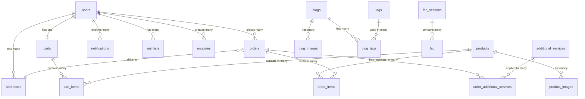

# YTL Concrete Hub - Database Documentation

This document provides comprehensive documentation for the YTL Concrete Hub database schema, built on Supabase (PostgreSQL).

## 📊 Database Overview

The database is designed to support a comprehensive concrete and construction materials ecommerce platform with the following key areas:

- **Product Management**: Products, categories, pricing, and inventory
- **User Management**: Customer accounts, addresses, and preferences
- **Order Processing**: Shopping carts, orders, payments, and fulfillment
- **Content Management**: Blogs, FAQs, and marketing content
- **Business Logic**: Additional services, freight charges, and notifications

## 🗂️ Database Schema

### 🛍️ Product Management Tables

#### `products`

Main product catalog table storing concrete and mortar products.

| Column           | Type        | Description                                          |
| ---------------- | ----------- | ---------------------------------------------------- |
| `id`             | uuid        | Primary key, auto-generated                          |
| `name`           | text        | Product name                                         |
| `description`    | text        | Detailed product description                         |
| `grade`          | text        | Concrete/mortar grade (C25, C30, etc.)               |
| `product_type`   | text        | Product category: 'concrete' or 'mortar'             |
| `mortar_ratio`   | text        | Mortar mixing ratio (for mortar products)            |
| `category`       | text        | Product category, default: 'building_materials'      |
| `normal_price`   | numeric     | Price for normal truck delivery                      |
| `pump_price`     | numeric     | Price for pump delivery                              |
| `tremie_1_price` | numeric     | Tremie delivery tier 1 price                         |
| `tremie_2_price` | numeric     | Tremie delivery tier 2 price                         |
| `tremie_3_price` | numeric     | Tremie delivery tier 3 price                         |
| `unit`           | text        | Unit of measurement, default: 'per m³'               |
| `stock_quantity` | integer     | Available inventory                                  |
| `status`         | text        | Publication status: 'draft', 'published', 'archived' |
| `is_featured`    | boolean     | Featured product flag                                |
| `keywords`       | text[]      | Search keywords array                                |
| `is_active`      | boolean     | Active status                                        |
| `created_at`     | timestamptz | Creation timestamp                                   |
| `updated_at`     | timestamptz | Last update timestamp                                |

**Business Logic:**

- Multiple pricing tiers support different delivery methods
- Stock tracking for inventory management
- Flexible product categorization for concrete and mortar

#### `product_images`

Product image gallery with sorting and primary image designation.

| Column       | Type        | Description                   |
| ------------ | ----------- | ----------------------------- |
| `id`         | uuid        | Primary key                   |
| `product_id` | uuid        | Foreign key to products table |
| `image_url`  | text        | Image storage URL             |
| `alt_text`   | text        | Accessibility alt text        |
| `is_primary` | boolean     | Primary product image flag    |
| `sort_order` | integer     | Display order                 |
| `created_at` | timestamptz | Upload timestamp              |

**Relationships:**

- `product_id` → `products.id` (CASCADE DELETE)

### 👥 User Management Tables

#### `addresses`

Customer shipping and billing addresses with soft delete support.

| Column          | Type        | Description                  |
| --------------- | ----------- | ---------------------------- |
| `id`            | uuid        | Primary key                  |
| `user_id`       | uuid        | Foreign key to auth.users    |
| `full_name`     | text        | Recipient full name          |
| `phone`         | text        | Contact phone number         |
| `address_line1` | text        | Primary address line         |
| `address_line2` | text        | Secondary address line       |
| `city`          | text        | City name                    |
| `state`         | text        | State/province               |
| `postal_code`   | text        | Postal/ZIP code              |
| `country`       | text        | Country, default: 'Malaysia' |
| `is_default`    | boolean     | Default address flag         |
| `deleted_at`    | timestamptz | Soft delete timestamp        |
| `created_at`    | timestamptz | Creation timestamp           |
| `updated_at`    | timestamptz | Last update timestamp        |

**Business Logic:**

- Supports multiple addresses per user
- Default address selection
- Soft delete for data integrity

### 🛒 Shopping & Orders Tables

#### `carts`

User shopping carts with one-to-one user relationship.

| Column       | Type        | Description                        |
| ------------ | ----------- | ---------------------------------- |
| `id`         | uuid        | Primary key                        |
| `user_id`    | uuid        | Foreign key to auth.users (UNIQUE) |
| `created_at` | timestamptz | Creation timestamp                 |
| `updated_at` | timestamptz | Last update timestamp              |

**Business Logic:**

- One cart per user (enforced by UNIQUE constraint)
- Persistent cart across sessions

#### `cart_items`

Individual items within shopping carts.

| Column         | Type        | Description                   |
| -------------- | ----------- | ----------------------------- |
| `id`           | uuid        | Primary key                   |
| `cart_id`      | uuid        | Foreign key to carts table    |
| `product_id`   | uuid        | Foreign key to products table |
| `variant_type` | text        | Delivery method variant       |
| `quantity`     | integer     | Item quantity                 |
| `selected`     | boolean     | Item selection for checkout   |
| `created_at`   | timestamptz | Addition timestamp            |
| `updated_at`   | timestamptz | Last update timestamp         |

**Relationships:**

- `cart_id` → `carts.id`
- `product_id` → `products.id`

#### `orders`

Main order processing table with comprehensive status tracking.

| Column              | Type        | Description                                                                |
| ------------------- | ----------- | -------------------------------------------------------------------------- |
| `id`                | uuid        | Primary key                                                                |
| `user_id`           | uuid        | Foreign key to auth.users                                                  |
| `status`            | text        | Order status: 'pending', 'processing', 'shipped', 'delivered', 'cancelled' |
| `payment_status`    | text        | Payment status: 'pending', 'paid', 'failed', 'refunded'                    |
| `payment_intent_id` | text        | Stripe payment intent ID                                                   |
| `subtotal`          | numeric     | Order subtotal                                                             |
| `shipping_cost`     | numeric     | Delivery charges                                                           |
| `tax`               | numeric     | Tax amount                                                                 |
| `total`             | numeric     | Total order amount                                                         |
| `notes`             | text        | Customer notes                                                             |
| `address_id`        | uuid        | Foreign key to addresses table                                             |
| `created_at`        | timestamptz | Order creation timestamp                                                   |
| `updated_at`        | timestamptz | Last update timestamp                                                      |

**Relationships:**

- `user_id` → `auth.users.id`
- `address_id` → `addresses.id`

**Business Logic:**

- Comprehensive order lifecycle tracking
- Integrated payment processing with Stripe
- Flexible pricing with tax and shipping calculations

#### `order_items`

Individual products within orders with historical pricing.

| Column         | Type        | Description                    |
| -------------- | ----------- | ------------------------------ |
| `id`           | uuid        | Primary key                    |
| `order_id`     | uuid        | Foreign key to orders table    |
| `product_id`   | uuid        | Foreign key to products table  |
| `name`         | text        | Product name at time of order  |
| `grade`        | text        | Product grade at time of order |
| `variant_type` | text        | Delivery method selected       |
| `price`        | numeric     | Price at time of order         |
| `quantity`     | integer     | Quantity ordered               |
| `image_url`    | text        | Product image at time of order |
| `created_at`   | timestamptz | Creation timestamp             |

**Business Logic:**

- Historical price preservation
- Product snapshot for order integrity

### 💼 Business Services Tables

#### `additional_services`

Configurable additional services with per-cubic-meter pricing.

| Column         | Type        | Description               |
| -------------- | ----------- | ------------------------- |
| `id`           | uuid        | Primary key               |
| `service_name` | text        | Service name              |
| `service_code` | text        | Unique service identifier |
| `rate_per_m3`  | numeric     | Price per cubic meter     |
| `description`  | text        | Service description       |
| `is_active`    | boolean     | Service availability      |
| `created_at`   | timestamptz | Creation timestamp        |
| `updated_at`   | timestamptz | Last update timestamp     |

#### `order_additional_services`

Additional services applied to specific orders.

| Column                  | Type        | Description                              |
| ----------------------- | ----------- | ---------------------------------------- |
| `id`                    | uuid        | Primary key                              |
| `order_id`              | uuid        | Foreign key to orders table              |
| `additional_service_id` | uuid        | Foreign key to additional_services table |
| `service_name`          | text        | Service name at time of order            |
| `rate_per_m3`           | numeric     | Rate at time of order                    |
| `quantity`              | numeric     | Service quantity (cubic meters)          |
| `total_price`           | numeric     | Calculated service cost                  |
| `created_at`            | timestamptz | Creation timestamp                       |

#### `freight_charges`

Tiered delivery pricing based on order volume.

| Column         | Type        | Description                   |
| -------------- | ----------- | ----------------------------- |
| `id`           | uuid        | Primary key                   |
| `min_volume`   | numeric     | Minimum volume for this tier  |
| `max_volume`   | numeric     | Maximum volume for this tier  |
| `delivery_fee` | numeric     | Delivery charge for this tier |
| `description`  | text        | Tier description              |
| `is_active`    | boolean     | Tier availability             |
| `created_at`   | timestamptz | Creation timestamp            |
| `updated_at`   | timestamptz | Last update timestamp         |

### 📝 Content Management Tables

#### `blogs`

Blog posts and articles with publication workflow.

| Column        | Type           | Description                              |
| ------------- | -------------- | ---------------------------------------- |
| `id`          | uuid           | Primary key                              |
| `title`       | text           | Blog post title                          |
| `description` | text           | Short description/excerpt                |
| `content`     | text           | Full blog content                        |
| `status`      | publish_status | Publication status: 'draft', 'published' |
| `link_name`   | text           | SEO-friendly URL slug                    |
| `link`        | text           | External link (if applicable)            |
| `image_url`   | text           | Featured image URL                       |
| `created_at`  | timestamptz    | Creation timestamp                       |
| `updated_at`  | timestamptz    | Last update timestamp                    |

#### `blog_images`

Additional images for blog posts.

| Column       | Type        | Description                |
| ------------ | ----------- | -------------------------- |
| `id`         | uuid        | Primary key                |
| `blog_id`    | uuid        | Foreign key to blogs table |
| `image_url`  | text        | Image storage URL          |
| `created_at` | timestamptz | Upload timestamp           |

#### `tags`

Reusable tags for content categorization.

| Column | Type | Description       |
| ------ | ---- | ----------------- |
| `id`   | uuid | Primary key       |
| `name` | text | Tag name (UNIQUE) |

#### `blog_tags`

Many-to-many relationship between blogs and tags.

| Column    | Type | Description                |
| --------- | ---- | -------------------------- |
| `id`      | uuid | Primary key                |
| `blog_id` | uuid | Foreign key to blogs table |
| `tag_id`  | uuid | Foreign key to tags table  |

#### `faq_sections`

FAQ organization sections.

| Column       | Type        | Description           |
| ------------ | ----------- | --------------------- |
| `id`         | uuid        | Primary key           |
| `name`       | text        | Section name (UNIQUE) |
| `created_at` | timestamptz | Creation timestamp    |

#### `faq`

Frequently asked questions with sectional organization.

| Column       | Type           | Description                       |
| ------------ | -------------- | --------------------------------- |
| `id`         | uuid           | Primary key                       |
| `question`   | text           | FAQ question                      |
| `answer`     | text           | FAQ answer                        |
| `section_id` | uuid           | Foreign key to faq_sections table |
| `status`     | publish_status | Publication status                |
| `created_at` | timestamptz    | Creation timestamp                |
| `updated_at` | timestamptz    | Last update timestamp             |

#### `posts`

Marketing posts and announcements.

| Column               | Type           | Description                  |
| -------------------- | -------------- | ---------------------------- |
| `id`                 | uuid           | Primary key                  |
| `title`              | text           | Post title                   |
| `description`        | text           | Desktop description          |
| `mobile_description` | text           | Mobile-optimized description |
| `link_name`          | text           | URL slug                     |
| `link`               | text           | External link                |
| `image_url`          | text           | Featured image               |
| `status`             | publish_status | Publication status           |
| `created_at`         | timestamptz    | Creation timestamp           |
| `updated_at`         | timestamptz    | Last update timestamp        |

### 🔔 Communication Tables

#### `notifications`

System notifications for users.

| Column       | Type        | Description                                                              |
| ------------ | ----------- | ------------------------------------------------------------------------ |
| `id`         | uuid        | Primary key                                                              |
| `user_id`    | uuid        | Foreign key to auth.users                                                |
| `title`      | text        | Notification title                                                       |
| `message`    | text        | Notification content                                                     |
| `type`       | text        | Notification type: 'order', 'promotion', 'system', 'payment', 'shipping' |
| `read`       | boolean     | Read status                                                              |
| `order_id`   | uuid        | Related order (optional)                                                 |
| `created_at` | timestamptz | Creation timestamp                                                       |
| `updated_at` | timestamptz | Last update timestamp                                                    |

#### `enquiries`

Customer service enquiries and support tickets.

| Column        | Type        | Description                     |
| ------------- | ----------- | ------------------------------- |
| `id`          | uuid        | Primary key                     |
| `user_id`     | uuid        | Foreign key to auth.users       |
| `name`        | text        | Customer name                   |
| `email`       | text        | Contact email                   |
| `subject`     | text        | Enquiry subject                 |
| `message`     | text        | Enquiry message                 |
| `status`      | text        | Enquiry status, default: 'open' |
| `staff_reply` | text        | Staff response                  |
| `created_at`  | timestamptz | Creation timestamp              |
| `updated_at`  | timestamptz | Last update timestamp           |

#### `wishlists`

User wishlists for products and content.

| Column       | Type        | Description                    |
| ------------ | ----------- | ------------------------------ |
| `id`         | uuid        | Primary key                    |
| `user_id`    | uuid        | Foreign key to auth.users      |
| `item_type`  | text        | Item type: 'blog' or 'product' |
| `item_id`    | uuid        | ID of the wishlist item        |
| `created_at` | timestamptz | Addition timestamp             |
| `updated_at` | timestamptz | Last update timestamp          |

## 🏗️ Custom Types

### `publish_status`

Enumeration for content publication workflow:

- `draft`: Content in development
- `published`: Live content

## 🔐 Row Level Security (RLS) Policies

_Note: Run the following query in Supabase SQL Editor to see all current policies:_

```sql
SELECT schemaname, tablename, policyname, roles, cmd, qual, with_check
FROM pg_policies
WHERE schemaname = 'public'
ORDER BY tablename, policyname;
```

### Recommended Policy Structure

#### User Data Policies

- **addresses**: Users can only access their own addresses
- **carts**: Users can only access their own cart
- **cart_items**: Users can only modify items in their own cart
- **orders**: Users can only view their own orders
- **notifications**: Users can only see their own notifications
- **wishlists**: Users can only manage their own wishlist
- **enquiries**: Users can only view their own enquiries

#### Public Read Policies

- **products**: Public read access for product catalog
- **product_images**: Public read access for product images
- **blogs**: Public read access for published blogs
- **blog_images**: Public read access for blog images
- **faq**: Public read access for published FAQs
- **posts**: Public read access for published posts
- **tags**: Public read access
- **additional_services**: Public read access for active services
- **freight_charges**: Public read access for active charges

#### Staff/Admin Policies

- **All tables**: Full CRUD access for authenticated staff users
- **Content management**: Create, update, delete access for content tables

## ⚙️ Database Functions

_Note: Run the following query to see all custom functions:_

```sql
SELECT routine_name, routine_definition, routine_type
FROM information_schema.routines
WHERE routine_schema = 'public'
AND routine_type = 'FUNCTION'
ORDER BY routine_name;
```

### Common Functions Needed

#### Cart Management

```sql
-- Function to calculate cart total
CREATE OR REPLACE FUNCTION calculate_cart_total(cart_uuid uuid)
RETURNS numeric AS $$
-- Function implementation here
$$ LANGUAGE plpgsql;
```

#### Order Processing

```sql
-- Function to create order from cart
CREATE OR REPLACE FUNCTION create_order_from_cart(user_uuid uuid, address_uuid uuid)
RETURNS uuid AS $$
-- Function implementation here
$$ LANGUAGE plpgsql;
```

#### Inventory Management

```sql
-- Function to update product stock
CREATE OR REPLACE FUNCTION update_product_stock(product_uuid uuid, quantity_change integer)
RETURNS boolean AS $$
-- Function implementation here
$$ LANGUAGE plpgsql;
```

## 📊 Database Relationships

### Primary Relationships



## 🚀 Usage Examples

### Product Queries

```sql
-- Get all published concrete products with pricing
SELECT p.*, pi.image_url as primary_image
FROM products p
LEFT JOIN product_images pi ON p.id = pi.product_id AND pi.is_primary = true
WHERE p.status = 'published'
  AND p.product_type = 'concrete'
  AND p.is_active = true
ORDER BY p.is_featured DESC, p.created_at DESC;
```

### Order Processing

```sql
-- Get complete order details with items
SELECT
  o.*,
  a.full_name, a.address_line1, a.city,
  oi.name as product_name, oi.quantity, oi.price
FROM orders o
JOIN addresses a ON o.address_id = a.id
JOIN order_items oi ON o.id = oi.order_id
WHERE o.user_id = $1
ORDER BY o.created_at DESC;
```

### Shopping Cart

```sql
-- Get user's cart with product details
SELECT
  ci.*,
  p.name, p.grade, p.normal_price, p.pump_price,
  pi.image_url
FROM cart_items ci
JOIN carts c ON ci.cart_id = c.id
JOIN products p ON ci.product_id = p.id
LEFT JOIN product_images pi ON p.id = pi.product_id AND pi.is_primary = true
WHERE c.user_id = $1;
```

## 📈 Performance Considerations

### Indexes

Essential indexes for optimal performance:

```sql
-- Product search performance
CREATE INDEX idx_products_status_type ON products(status, product_type);
CREATE INDEX idx_products_search ON products USING gin(to_tsvector('english', name || ' ' || description));

-- Order processing performance
CREATE INDEX idx_orders_user_status ON orders(user_id, status);
CREATE INDEX idx_orders_created_at ON orders(created_at DESC);

-- Cart performance
CREATE INDEX idx_cart_items_cart_id ON cart_items(cart_id);
CREATE INDEX idx_cart_items_product_id ON cart_items(product_id);
```

### Query Optimization

- Use appropriate JOINs instead of subqueries where possible
- Implement pagination for large result sets
- Use partial indexes for frequently filtered columns
- Consider materialized views for complex analytics queries

## 🔧 Maintenance

### Regular Tasks

1. **Cleanup soft-deleted addresses** (older than 1 year)
2. **Archive completed orders** (older than 2 years)
3. **Clean up abandoned carts** (older than 30 days)
4. **Update product search indexes**
5. **Analyze query performance**

### Backup Strategy

- **Daily**: Automated Supabase backups
- **Weekly**: Full schema and data export
- **Monthly**: Point-in-time recovery testing

---

## 📞 Support

For database-related questions or schema modifications, contact the development team or refer to the [Supabase documentation](https://supabase.com/docs).
